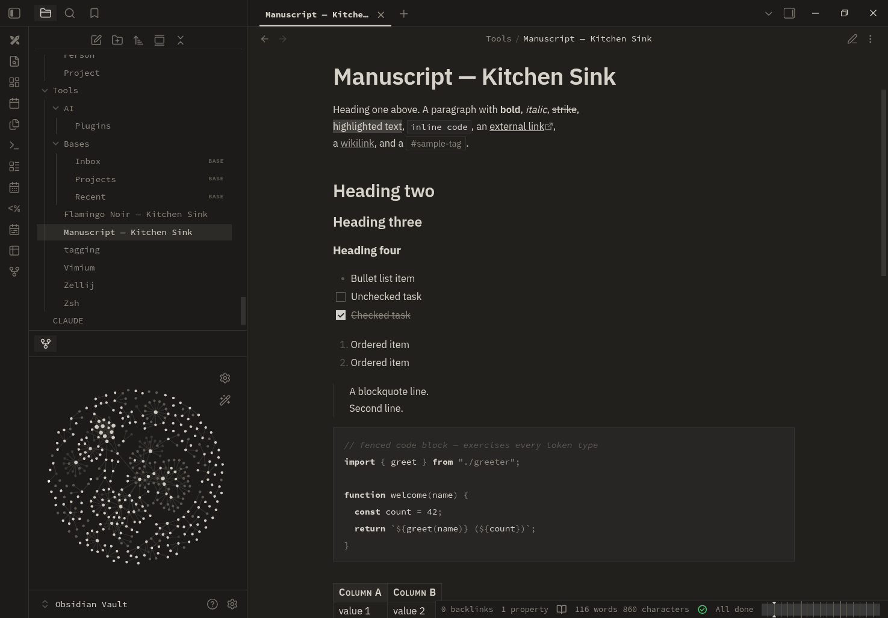

# Manuscript

A quiet, monochrome editorial theme for Obsidian: a warm paper background,
near-black ink, IBM Plex Sans throughout, hairline rules and generous
whitespace. No colour — hierarchy comes from weight, ink tone, hairline rules,
and small-caps. Light and dark "paper" modes, both art-directed.

## Install

- **Community directory** (once accepted): Settings → Appearance → Manage, then
  search for *Manuscript*.
- **Manual:** create a folder named `Manuscript` in
  `<your vault>/.obsidian/themes/`, copy `manifest.json` and `theme.css` from
  this repository into it, then select it under Settings → Appearance → Themes.
- **BRAT:** add `jackMort/manuscript` in the BRAT community plugin.

## Design

- **Monochrome.** No chromatic colour anywhere — a warm greyscale palette in
  both modes. Links, headings and active states are set apart by weight,
  underline, ink tone and a faint ink wash, never by hue.
- **Editorial sans.** IBM Plex Sans for text and headings, on a clear size
  scale; IBM Plex Mono for code.
- **Hairline rules** are the main structural device — table cells, callouts,
  code blocks, dividers.
- **Small-caps labels** for callout titles, table headers and the Properties
  panel, echoing a print type specimen.
- **Square and flat.** Hard corners, no glow, no drop shadows.
- A fully art-directed **light "paper"** and **dark "paper"** mode.

## Fonts

The theme sets an `IBM Plex Sans` stack for text (and `IBM Plex Mono` for
code), imported from Google Fonts with `ui-sans-serif` / `ui-monospace`
fallbacks. Installing [IBM Plex](https://fonts.google.com/specimen/IBM+Plex+Sans)
gives the intended look but is optional. Fonts can be overridden in
Settings → Appearance.

## License

[MIT](LICENSE) © Lech Twaróg
